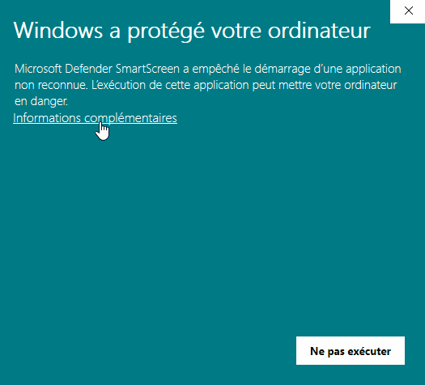
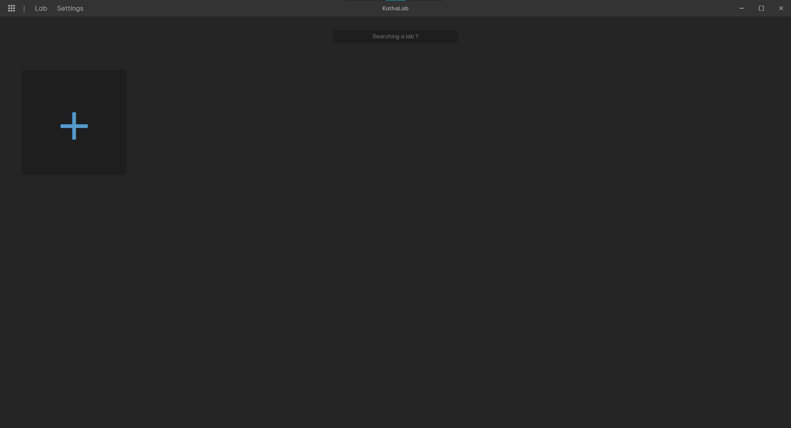

# Guide d’utilisation

# Mise en place

Pour débuter il vous faudra télécharger un installateur depuis [GitHub](https://github.com/xernois/projet-kathara/releases) en fonction de votre OS.

## Windows

Téléchargerez le fichier .exe disponible.

Une fois le fichier téléchargé, exécutez le.

**⚠️** Si toute fois vous avez cette fenêtre qui apparaît, vous cliquerez sur informations complémentaire puis “Exécuter quand même”

## Linux

Télécharger le fichier .zip disponible.

Une fois le fichier .zip téléchargé, il vous faudra décompresser le fichier. 

Vous y trouverez un fichier [projet-kathara]

## Mac

<aside>
⚠️ Pas encore disponible

</aside>

---

# Découverte

### Page Galerie

Voici la page galerie, la page dans laquelle vous arriverez en lançant Kathalab

Page Galerie

---

Pour créer votre première topologie vous pourrez cliquer sur le bouton suivant

Bouton pour ajouter une topologie

---

Vous aurez aussi la possibilité de pouvoir importer une topologie existante avec l’option Import

Onglet Lab

---

Si des topologies sont existantes vous aurez la possibilité de les ouvrir avec l’option Open ou bien en cliquant sur son image dans la galerie.

Galerie avec plusieurs topologie

---

Si vous possédez de nombreuse topologies dans votre galerie vous aurez la possibilité de la rechercher avec son nom.

Recherche d’un lab dans la galerie

---

### Page Conception

Voici la page de conception des topologies encore vierge

Page de conception

---

Vous avez la possibilité de nommer votre topologie, ça se situe tout en haut dans la barre de navigation.

Barre de nommage de topologie

---

Menu des différents composants

Sur votre gauche vous trouverez un menu proposant les différents composant que vous pourrez placer dans votre topologie.

---

Pour placer les éléments dans la scène vous avez la possibilité de cliquer ou bien de faire un glisser-déposer.

Démonstration clique et glisser-déposer

---

Une fois qu’un composant est placé dans la scène, vous avez la possibilité de le sélectionner en cliquant dessus. Le composant sélectionné apparaîtra en surbrillance.

Composant sélectionné

---

Ce qui fera apparaître sur la droite de votre écran un menu déroulant dans lequel vous pourrez configurer votre composant.

Menu composant

<aside>
⚠️ Pour ce qui va suivre quelque connaissance de base en réseaux vous serons utile

</aside>

Menu composant

Voici le menu une fois ouvert de votre composant. Vous aurez la possibilité de :

- Renommer votre composant

Barre de nommage composant

- Ajouter des interfaces, pour lesquelles vous pourrez ajouter une addresse ip, le CIDR, le domaine de collision et pour finir d’activer ou non l’addresse ip ( `ip link set eth0 [up/down]`).
    
    Vous pourrez ajouter autant d’interface que souhaité.
    

Paramétrage interface composant

- Définir les commandes à exécuter au lancement ou avant l’arrêt d’un lab Kathara.

Paramétrage startup, shutdown command composant

- Définir des paramètres optionnel comme les bridges par exemple.

Paramétrage optionnel composant

---

### Page Préférence

Accessible depuis l’onglet Settings situé dans la barre de navigation

Barre de navigation

---

Vous y retrouverez les paramètres globaux de l’application : 

- La langue
- Le thème
- Répertoire ou l’on souhaite sauvegarder nos topologies

Paramètre globaux

---

Egalement les différents raccourcis clavier qui sont disponible dans notre application, ces raccourcis n’ont pas encore la possibilité d’être modifié. 

Raccourci clavier